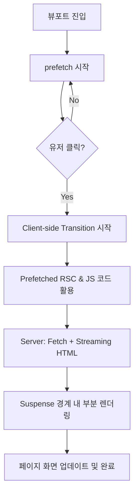

# Navigating - APP ROUTER

- **페이지 이동**이나 **pre-fetching**시에 서버가 브라우저에게 `JS번들 + RSC paylod`를 함께 전달
  - JS번들에는 서버 컴포넌트가 빠져 있기 때문에, 브라우저에게 함께 보내주기 위해 RSC Payload를 같이 전달하게 됨

## APP Router 페이지 이동 작동 방식

- `Page Router`과 동일하게 초기 접속 이후에는 `CRS`방식으로 동작 -> `JS번들 + RSC paylod` 전달 -> (브라우저) JS번들 실행 후 RSC Payload와 합쳐서 페이지를 교체하게 됨

### 📚 인용 (References)

- [한 입 크기로 잘라먹는 Next.js(v15) 강의 | 이정환 Winterlood](https://www.inflearn.com/course/%ED%95%9C%EC%9E%85-%ED%81%AC%EA%B8%B0-nextjs)
